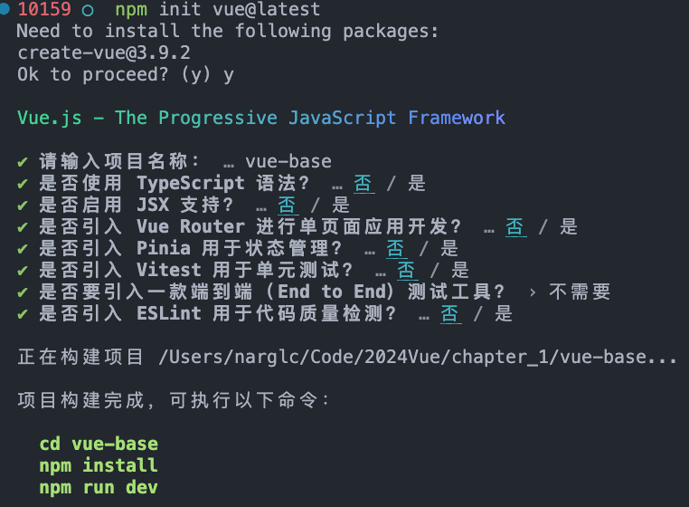
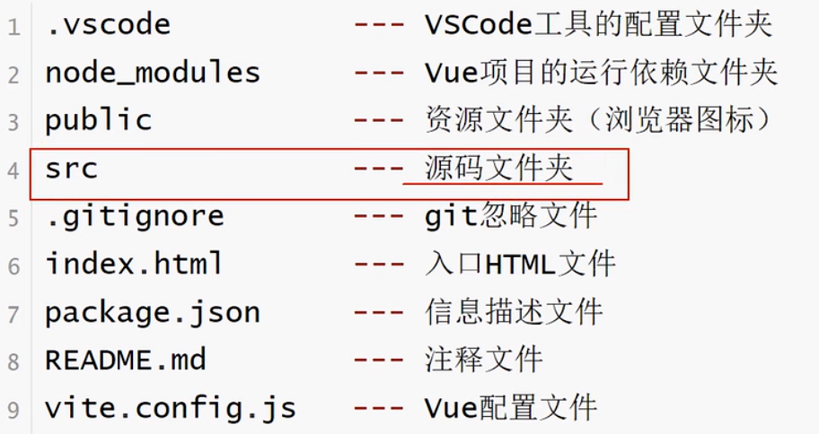
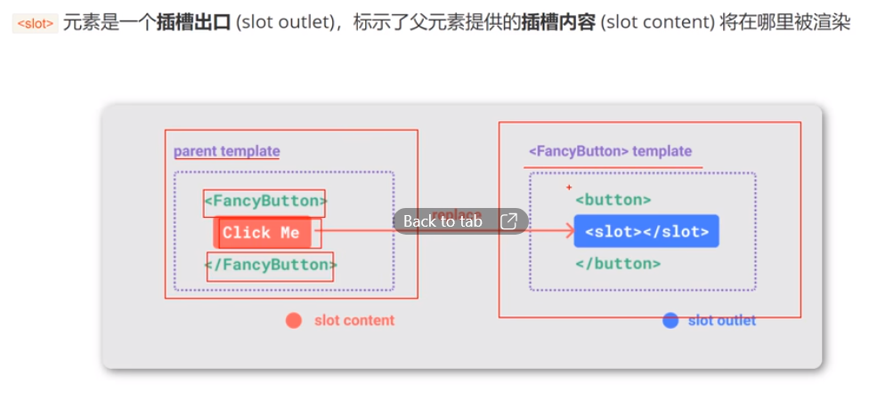
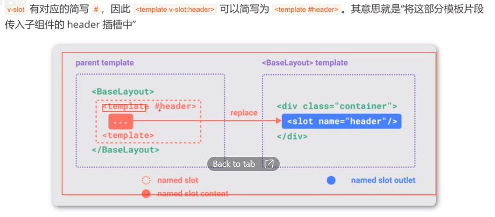
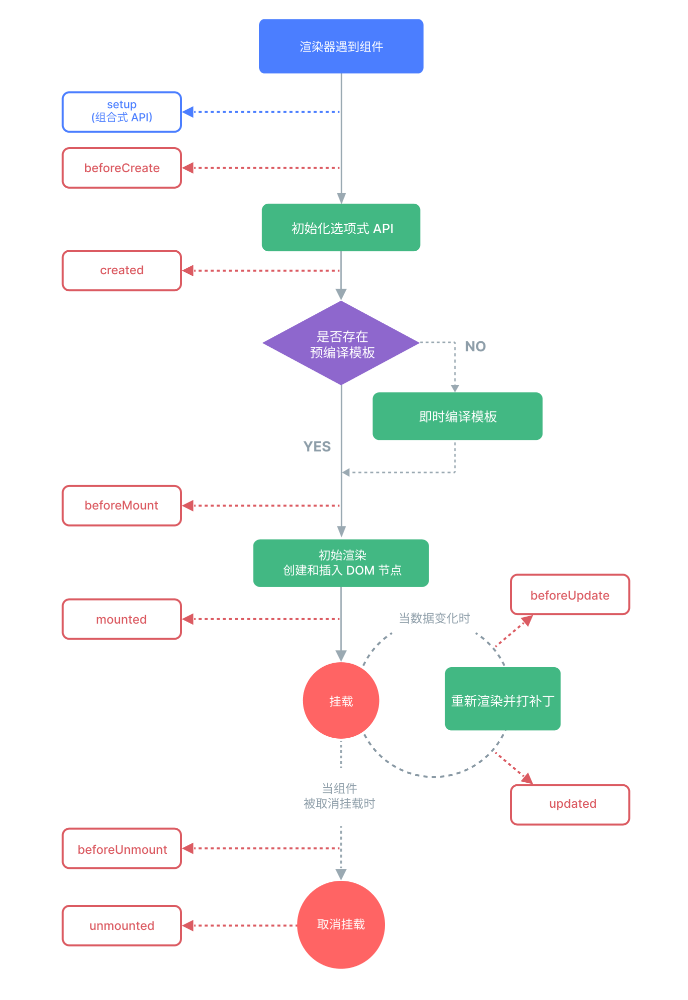

# 环境准备

## 升级 node 版本
```bash
# 使用 n 模块
npm install n -g        # 安装 n
n -V                    # 查看 n 模块版本

#使用 n 模块升级node版本
n latest                # 升级到最新版本
n lts                   # 升级到长期支持版本
n stable                # 升级到最新的稳定版本
```

## 升级 npm
```bash
sudo npm install npm -g
```

# vue 笔记

## CH01-vue基础

### 项目初始化
```bash
# 初始化项目
npm init vue@latest      # 执行 create-vue
# 或者 更新写法
npm create vue@latest    # 更推荐

# 运行
cd vue-base              # 项目命名时不应该有大写字母
npm install
npm run dev
```
#### init 初始化详情


#### 项目文件说明



### 开发环境
推荐：`vscode` + `volar`插件.


----
### 通用缩写
```
v-bind      :
v-on        @
v-slot      #
```

----

## 插槽基础知识




## 组件生命周期


----

## 页面布局
[Flex 布局教程：实例篇](https://www.ruanyifeng.com/blog/2015/07/flex-examples.html)

----

## CSS 参考
[CSS 菜鸟教程](https://www.runoob.com/css/css-navbar.html)